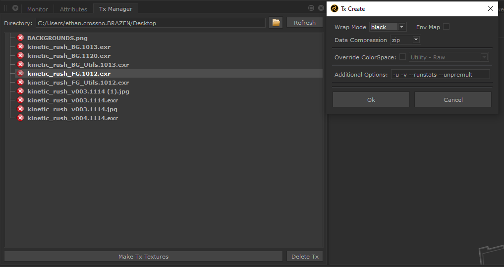

# tx_manager

A multithreaded dcc agnostic tool that lets users batch create .tx files from existing images in a directory using maketx. It also handles the conversion of those textures from srgb space into the ACES colorspace with OCIO using naming conventions or user overrides.

https://github.com/user-attachments/assets/b67a2106-2dd3-4358-9729-c663f611d11d

## Features

- **Batch Processing** — Convert multiple textures to `.tx` files in one operation using `maketx`
- **Multithreaded** — Processes textures concurrently via Qt's QThreadPool with thread-safe progress tracking
- **OCIO Color Management** — Automatically detects source color spaces from filenames and converts to scene-linear using OpenColorIO, with manual override options
- **UDIM Support** — Expands `<UDIM>` patterns to process full texture sequences
- **Directory Browser** — Tree view showing all textures in a directory with status icons indicating whether `.tx` files exist
- **Configurable Options** — Wrap mode, compression format, environment map flag, color space override, and additional `maketx` flags

## Supported Formats

`.png`, `.jpg`, `.hdr`, `.bmp`, `.tif`, `.tga`, `.tex`, `.exr`, `.dpx`

## Configuration Options

| Option | Values |
|---|---|
| Wrap Mode | clamp, black, periodic, mirror |
| Compression | none, rle, zip, pxr24, b44, b44a |
| Color Space Override | Utility - Raw, Utility - sRGB - Texture, Utility - sRGB - linear, ACES - ACEScg, Output - sRGB |
| Environment Map | `--envlatl` toggle |
| Additional Flags | Free-form (defaults to `-u -v --runstats --unpremult`) |

## Dependencies

- [qtpy](https://github.com/spyder-ide/qtpy) — Qt abstraction layer (PyQt5/PySide2)
- [PyOpenColorIO](https://opencolorio.readthedocs.io/) — Color space management
- [OpenImageIO](https://openimageio.readthedocs.io/) — `maketx` command-line tool

## License

MIT
